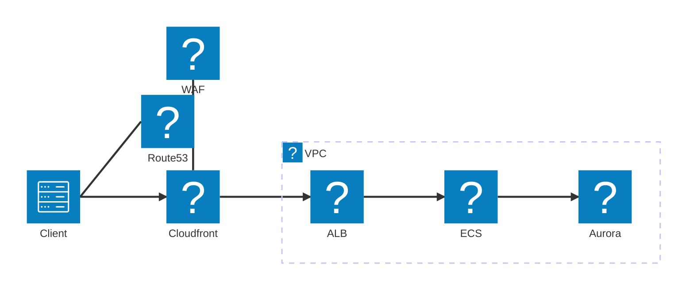

```mermaid
architecture-beta
    group vpc(logos:aws-vpc)[VPC]

    service aurora(logos:aws-aurora)[Aurora] in vpc
    service route53(logos:aws-route53)[Route53]
    service alb(logos:aws-elb)[ALB] in vpc
    service ecs(logos:aws-ecs)[ECS] in vpc
    service client(server)[Client]
    service cloud_front(logos:aws-cloudfront)[Cloudfront]
    service waf(logos:aws-waf)[WAF]

    client:R -- L:route53
    client:R --> L:cloud_front
    waf:B -- T:cloud_front
    cloud_front:R --> L:alb
    alb:R --> L:ecs
    ecs:R --> L:aurora

```
